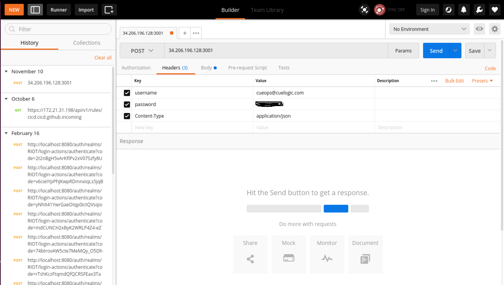

## What is CueOps?

CueOps is an integrated open source DevOps and Integration Platform which works out of the box with Docker evironment and provides Continuous Integration, Continuous Delivery, Management, Logging and Monitoring.

CueOps gives you out of the box services that assist you when building Microservices, monoliths or any application in a linux container (Docker) environment and is built on top of Docker Swarm cluster.

## PreRequisites
## 1. Source Control Management (GitHub)
   - A GitHub Bot account that should have access to clone the repo, creating webhooks etc.  
   - One repository containing all the Docker compose files.
   - Don't familiar with Docker compose files? You can find the sample docker compose file [here](./docker-compose.yml).

## 2. Docker
   - Application stack should be running on Docker. All you need is a Dockerfile residing into your repository. 
   - [Docker Swarm Mode](https://docs.docker.com/engine/swarm/). 
   - [Docker compose](https://docs.docker.com/compose/overview/).
   - [Docker Hub](https://hub.docker.com/) username and password to store the Application stack Docker Images.
   - Docker Swarm Manager Certificates and IP. 
   - You can execute this [script](./swarm-certs.sh) to generate docker swarm certificates.
  
## 3. Alerts and Notification receivers
   - CueOps supports several tools like Slack, Email etc.
   - Slack
      - Slack Username
      - Slack Channel name (Ex. #notification)
      - Slack incoming webhhok url. 
      
### Obtaining a Webhook URL

To configure a webhook and obtain a URL, go to https://[your company].slack.com/services/new/incoming-webhook, select a
channel you would like the messages to be posted to and click on "Add Incoming WebHooks Integration" button.

On the next page you will find an automatically generated webhook URL.

## 4. Jenkinsfile
   - [Jenkinsfile](https://jenkins.io/doc/book/pipeline/jenkinsfile/)  is a text file that contains the definition of a Jenkins Pipeline and is checked into source control.
   - [Jenkinsfile](https://jenkins.io/doc/book/pipeline/jenkinsfile/) should be checked into each source control repository to build the Continuous Integration pipeline.
   - A sample [Jenkinsfile](https://jenkins.io/doc/book/pipeline/jenkinsfile/) can be found [here](./Jenkinsfile) with the       detailed description. 
   
## CueOps integration steps

Does your project meets all the prerequisites? Let's get started with the integration process:

   - Integrating your project with CueOps is just a matter of hitting an API endpoint url. Keep your project data ready in a json structure and make an POST API call to CueOps API endpoint url (34.206.196.128:3001) with valid json data. 
   - We have set basic authentication on the API endpoint. The authentication details would be shared with the projects.
   - Well, we have created a sample json structured file explained in detail, which you can always refer for your projects. find the sample json body structure [here](../screenshots/Project-sample.json).
   
## Making POST api call

You can make POST api call with any tools like curl, Postman etc. An API call using Postman tool has shown below:

   

