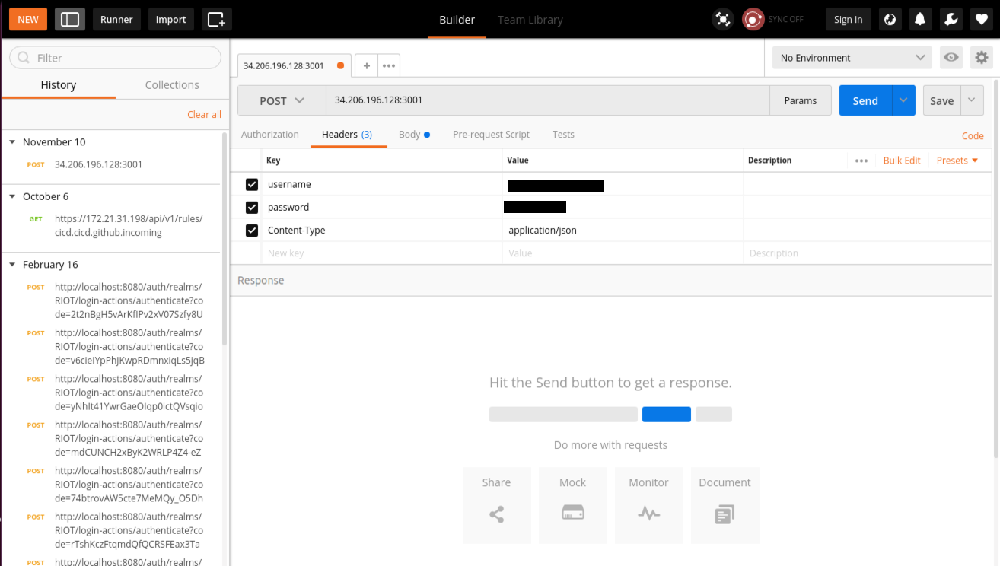

## What is CueOps?

CueOps is an integrated open source DevOps and Integration Platform which works out of the box with Docker evironment and provides Continuous Integration, Continuous Delivery, Management, Logging and Monitoring.

CueOps gives you out of the box services that assist you when building Microservices, monoliths or any application in a linux container (Docker) environment and is built on top of Docker Swarm cluster.

## PreRequisites
## 1. Source Control Management (GitHub)
   - A GitHub Bot account that should have access to clone the repo, creating webhooks etc.  
   - One repository containing all the Docker compose files.
   - Don't familiar with Docker compose files? You can find the sample docker compose file [here](./docker-compose.yml).

## 2. Docker
   - Application stack should be running on Docker. All you need is a Dockerfile residing into your repository. 
   - [Docker Swarm Mode](https://docs.docker.com/engine/swarm/). 
   - [Docker compose](https://docs.docker.com/compose/overview/).
   - [Docker Hub](https://hub.docker.com/) username and password to store the Application stack Docker Images.
   - Docker Swarm Manager Certificates and IP. 
   - You can execute this [script](./swarm-certs.sh) to generate docker swarm certificates.
  
## 3. Alerts and Notification receivers
   - CueOps supports several tools like Slack, Email etc.
   - Slack
      - Slack Username
      - Slack Channel name (Ex. #notification)
      - Slack incoming webhhok url. 
      
### Obtaining a Webhook URL

To configure a webhook and obtain a URL, go to https://[your company].slack.com/services/new/incoming-webhook, select a
channel you would like the messages to be posted to and click on "Add Incoming WebHooks Integration" button.

On the next page you will find an automatically generated webhook URL.

## 4. Jenkinsfile
   - [Jenkinsfile](https://jenkins.io/doc/book/pipeline/jenkinsfile/)  is a text file that contains the definition of a Jenkins Pipeline and is checked into source control.
   - [Jenkinsfile](https://jenkins.io/doc/book/pipeline/jenkinsfile/) should be checked into each source control repository to build the Continuous Integration pipeline.
   - A sample [Jenkinsfile](https://jenkins.io/doc/book/pipeline/jenkinsfile/) can be found [here](./Jenkinsfile) with the       detailed description. 
   
## CueOps integration steps

Does your project meets all the prerequisites? Let's get started with the integration process:

   - Integrating your project with CueOps is just a matter of hitting an API endpoint url. Keep your project data ready in a json structure and make an POST API call to CueOps bootstrap API endpoint url (will be provided at project integration time) with valid json data. 
   - We have set basic authentication on the API endpoint. The authentication details would be shared with the projects.
   - Well, we have created a sample json structured file explained in detail, which you can always refer for your projects. find the sample json body structure [here](./Project-sample.json).
   
## How to make POST api call?

You can make POST api call with any tools like curl, Postman etc. An API call using Postman tool has shown below:

## What will happen after making an API call?

   - As soon as you make the API call, the reponse of API call will be returned with the status **"STARTED"**.
   - The Projects will get the complete access of components like [Jenkins](https://jenkins.io/) as Continuous Integration tool, Stackstorm(https://stackstorm.com/) as Continuous Deployment tool, [Kibana](https://www.elastic.co/products/kibana) as the front end logging tool and [Grafana](https://grafana.com/) as the console to view, query and analyze metrics tool.
   - To have access of all of these tools, you have to provide authentication details like username and password. 
   - You can get the credentials to have access of all of these components by just making a **GET** API request to CueOps bootstrap API endpoint url (will be provided at project integration time).
   
**API GET response view**

## Jenkins as CI tool

You will have complete access your project's Jenkins dashboard by hitting url https://projectname-jenkins.cueops.io and provide valid username and password which you got from GET API response. You can see all the Jenkins jobs configured for your repositories.

**Jenkins Dashboard view**

## Logging and Monitoring 

CueOps provide Monitoring and Logging stacks deployment out of the box along with CI/CD. It will minimize the application downtime drastically. You will have access of all the Application and Infrastructure Logs and Metrics in a single dashboard.

Let's further explore the Logging and Monitoring stacks separately, 

## Logging 

Logging is a key part of being able to understand Microservices and diagnose issues. Consolidating log statements and events and being able to query and visualise them is an extremely useful tool.

CueOps Logging Microservices Platform runs **[Elasticsearch](https://www.elastic.co/)** for the back end storage and **[Kibana](https://www.elastic.co/products/kibana)** as the front end and **[Logstash](https://www.elastic.co/products/logstash)** as the collector.

- **Kibana Dashboard View** 

## Monitoring

Monitoring is the first step towards optimizing and improving performance.It's the most crucial thing when you deploying your application as microservices. 

CueOps monitoring Microservices Platform uses **[Prometheus](https://prometheus.io/docs/prometheus/latest/installation/)** as the back end storage service and REST API and then **[Grafana](https://grafana.com/)** as the console to view, query and analyze metrics and then **[Slack](https://slack.com/)** as alerts and notifications receivers.

**Overall Docker Swarm Cluster Metrics Dashboard**

**Docker containers CPU metrics**

**Docker containers Memory metrics**

